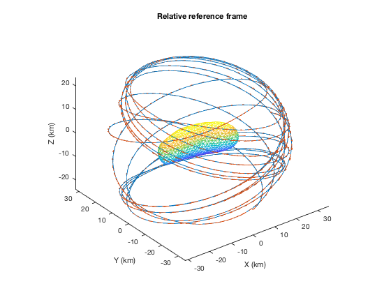
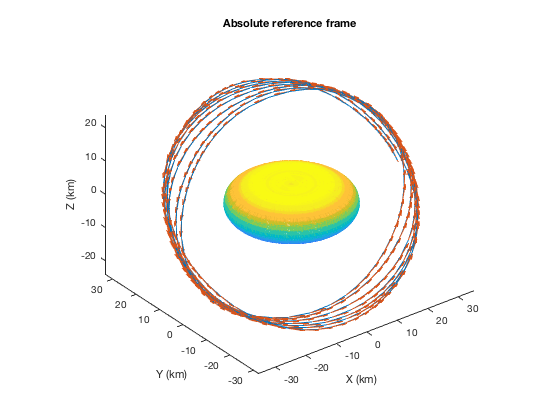

# small_body_dynamics

Integrators to simulate the orbital dynamics of a spacecraft in orbit
around a small body, and gravity and shape models for 433 Eros.

## SphericalHarmonicsGravityIntegrator
A class implementing an in-house integrator for the two-body problem
with a spherical harmonics gravity model.

## SphericalHarmonicsGravityIntegrator_SBDT
A class wrapping the SBDT integrators for the two-body problem with
various gravity models, including spherical harmonics and polyhedral
models.

Usage examples are provided in `exploreErosGravity.m`.
A demo of SBDT's multiple gravity models is available in `EROS 433/SBDT_demo_Eros.m`.

## Example Output

